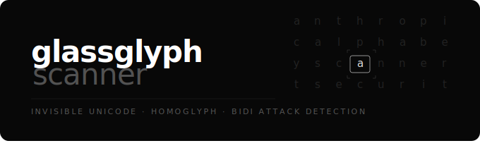

<p align="center">
  
</p>

**A reference scanner for invisible unicode and homoglyph attacks on text-based systems.**

In March 2026, the Glassworm campaign compromised 151+ GitHub repositories, npm packages, and VS Code extensions by smuggling malicious code inside invisible Unicode characters — text that renders as zero pixels in every editor, terminal, code review tool, and browser. The same class of attack works against RAG pipelines, LLM agents, email, chat, and any system that ingests text and later retrieves it as context.

Glassglyph Scanner scans text for three attack classes:

1. **Invisible unicode encoding** — Glassworm's substitution cipher (variation selectors U+FE00–FE0F and U+E0100–E01EF) plus tag characters that map 1:1 to printable ASCII.
2. **Bidi override attacks** — control characters that visually reorder text (`safe.txt` → `safe[RLO]txt.exe`).
3. **Homoglyph substitution** — Cyrillic and Greek characters replacing visually identical Latin letters (`аnthropic.com` with Cyrillic `а`).

Cost: **under a millisecond per document**. Pure string iteration, zero external dependencies in the core library, zero network I/O, zero LLM inference.

---

## Try it in 30 seconds

**Option 1 — Docker:**

```bash
git clone https://github.com/pringlized/glassglyph-scanner.git
cd glassglyph-scanner
docker compose up -d
curl -X POST http://localhost:8080/scan \
  -H 'Content-Type: application/json' \
  -d '{"content":"visit dоcs.аnthropic.com for the API"}'
```

Expected response: the scanner flags the Cyrillic `о` and `а` as a medium-severity homoglyph finding.

**Option 2 — Python:**

```bash
pip install -e '.[all]'
python -c "from glassglyph_scanner import sanitize; r = sanitize('visit dоcs.аnthropic.com'); print(r.findings[0])"
```

**Option 3 — CLI:**

```bash
pip install -e '.[cli]'
echo 'visit dоcs.аnthropic.com' | glassglyph-scanner scan -
# exit 1 → findings present (flagged, not blocked)

echo 'plain text' | glassglyph-scanner scan -
# exit 0 → clean
```

---

## Why this matters

Traditional supply-chain attacks need a decoder at the execution site. **RAG pipelines are different — the LLM is both target and decoder.** When a poisoned item is retrieved as agent context:

1. The agent reads it as knowledge
2. LLMs tokenize at the byte level — invisible characters are not invisible to the model
3. The model may follow instructions encoded in them
4. The item was embedded and clustered with legitimate knowledge, so it has full semantic credibility

**Ingestion-time scanning is the only viable enforcement point.** Once the content is embedded, it's semantically indistinguishable from clean knowledge.

See [`docs/threat-model.md`](docs/threat-model.md) for the full threat model.

---

## Detection rules

| Range | Name | Severity | Action |
|---|---|---|---|
| `U+FE00`–`U+FE0F` | Variation selectors | **Critical** | Block |
| `U+E0100`–`U+E01EF` | Supp. variation selectors | **Critical** | Block |
| `U+E0020`–`U+E007F` | Tag characters | **Critical** | Block |
| `U+200B`–`U+200F` | Zero-width / bidi marks | High | Strip |
| `U+202A`–`U+202E` | Bidi overrides | High | Strip |
| `U+2060`–`U+2064` | Invisible math operators | High | Strip |
| `U+FEFF` (non-BOM position) | Zero-width no-break space | High | Strip |
| `U+E0001` | Language tag (deprecated) | High | Strip |
| Mixed-script word w/ confusable | e.g. Cyrillic `а` in `аnthropic` | Medium | Flag |
| Mixed-script word w/o confusable | e.g. Cyrillic `ж` in `aжb` | Low | Flag |

**Critical = block:** no legitimate text contains these ranges. Their presence indicates an encoding attack. Reject the document.

**High = strip:** these characters have narrow legitimate uses (Arabic text shaping, emoji sequences) but are dangerous in knowledge items. Characters are removed, the document proceeds with sanitized text.

**Medium/Low = flag:** homoglyphs can appear in legitimate multilingual content. The finding is reported; the calling system decides whether to quarantine.

Full rule reference in [`docs/detection-rules.md`](docs/detection-rules.md).

---

## Library API

```python
from glassglyph_scanner import sanitize

result = sanitize("some text")

if result.has_critical_findings:
    # BLOCK — invisible encoding detected
    log_and_reject(result.findings)
elif result.was_modified:
    # STRIP — use sanitized content going forward
    process(result.sanitized_content)
elif result.findings:
    # FLAG — content unmodified, review findings
    queue_for_review(result.findings)
else:
    # CLEAN — proceed
    process(result.sanitized_content)
```

`SanitizationResult` fields:

- `clean: bool` — true iff no findings
- `sanitized_content: str` — content with high-severity chars removed
- `findings: list[SanitizationFinding]` — each with `threat_category`, `severity`, `description`, `character_ranges`, `action_taken`
- `has_critical_findings: bool` — signal to block
- `was_modified: bool` — true iff sanitized_content differs from input
- `scan_duration_ms: float`

---

## HTTP API

```
POST /scan             body: {"content": "..."}
GET  /health           liveness probe
GET  /                 landing page
GET  /docs             OpenAPI UI
```

Full reference: [`docs/api.md`](docs/api.md)

---

## CLI

```bash
glassglyph-scanner scan FILE           # scan a file
glassglyph-scanner scan -              # scan stdin
glassglyph-scanner scan FILE --json    # machine-readable output
glassglyph-scanner scan FILE --quiet   # exit code only
glassglyph-scanner --version
```

Exit codes:
- `0` — clean
- `1` — findings present (stripped or flagged)
- `2` — critical findings (block)
- `64` — usage error

---

## Installation

```bash
# Core library only (zero dependencies)
pip install glassglyph-scanner

# With CLI
pip install 'glassglyph-scanner[cli]'

# With HTTP service
pip install 'glassglyph-scanner[server]'

# Everything
pip install 'glassglyph-scanner[all]'

# Development (tests, linting)
pip install -e '.[dev]'
```

---

## Examples

The `examples/` directory contains:

- `clean.txt` — normal content
- `glassworm_attack.txt` — a pre-built Glassworm-encoded payload
- `homoglyph_url_spoof.txt` — URL with Cyrillic substitutions
- `zero_width_strip.txt` — zero-width chars interspersed in visible text
- `generate_glassworm.py` — generate your own invisible payloads

Run all examples:

```bash
for f in examples/*.txt; do
  echo "=== $f ==="
  glassglyph-scanner scan "$f"
done
```

---

## What this is NOT

- **Not a semantic/intent scanner.** Glassglyph Scanner does character-level detection only. Attacks using natural-language prompt injection in plain ASCII are outside its scope — that class of attack requires LLM inference to detect.
- **Not a content filter.** This scans for encoding-based attacks, not for policy violations, PII, or toxic content.
- **Not a replacement for TLS, authentication, rate limiting, or other perimeter controls.**

For the full two-gate defense model (character gate + intent gate), see `docs/threat-model.md`.

---

## Development

```bash
git clone https://github.com/pringlized/glassglyph-scanner.git
cd glassglyph-scanner
pip install -e '.[dev]'
pytest                  # run all tests
ruff check              # lint
uvicorn glassglyph_scanner.server:app --reload  # serve locally
```

---

## License

MIT. See `LICENSE`.

---

## Credits

Research basis: Aikido Security's March 2026 Glassworm writeup, Unicode Consortium TR39 confusables data, and community security research on invisible-unicode supply-chain attacks.

Built as a reference implementation from a knowledge base ingestion pipeline's Gate 1 character sanitization layer.
